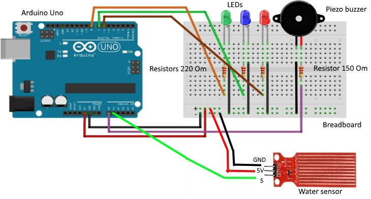

# Arduino Water Level Sensor Project



## Overview

🚨 Build an Arduino Water Level Sensor with Buzzer & LED alerts! 🌊 Learn step-by-step creating a simple water level monitoring system. This beginner-friendly project requires only basic components like Arduino, a water level sensor, a buzzer, resistor, jumper cables, breadboard, and LEDs.

## Components Needed

- Arduino Board
- Water Level Sensor
- Buzzer
- Resistor
- Jumper Cables
- Breadboard
- LEDs

## Project Steps

1. Connect the Water Level Sensor to the Arduino.
2. Wire the Buzzer and LEDs for alerts.
3. Add a resistor for proper circuitry.
4. Upload the provided C++ code to your Arduino.

## Project Blueprint


*Image credit: [Acoptex](https://acoptex.com/)*

## Arduino Code

```bash
git clone https://github.com/Jgarette0/Water-Level-Sensor.git
